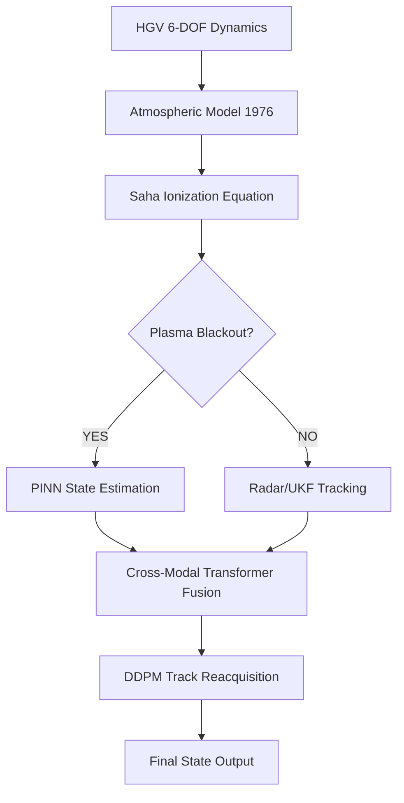

# PhysNet-HGV: High-Fidelity Hypersonic Tracking & Reacquisition

**Integrated Physics-Informed Neural Framework for State Estimation of Maneuvering Hypersonic Glide Vehicles Under Plasma Blackout.**

[](https://www.python.org/downloads/)
[](https://pytorch.org/)
[](https://opensource.org/licenses/MIT)

---

## 🚩 1. Problem Statement: The Hypersonic "Blind Spot"

Hypersonic Glide Vehicles (HGVs) maneuver at altitudes between 30-70km and speeds of **Mach 5 to Mach 20**. This regime presents a critical challenge for global security and tracking infrastructure:

1.  **Plasma Blackout**: At these velocities, shock-induced thermal energy ionizes the surrounding air (reaching temperatures >4000K). This creates a "plasma sheath" that is impenetrable to traditional S-band and X-band radar frequencies.
2.  **High Maneuverability**: Unlike ballistic missiles, HGVs perform non-ballistic "skip" and "pull-up" maneuvers, making their trajectories unpredictable during the blackout period.
3.  **Sensor Scarcity**: Ground-based radar loses track during the mid-course phase, and satellite-based infrared (IR) sensors suffer from thermal noise and resolution limits in the upper atmosphere.

**The Goal**: Maintain a continuous, high-fidelity track of the HGV even when all direct sensor measurements are lost during cumulative blackout periods.

---

## 💡 2. The Solution: PhysNet-HGV

PhysNet-HGV solves this by fusing **Classical Flight Dynamics** with **Modern Generative AI**. Instead of relying on raw sensor data, the system predicts the vehicle's state by enforcing the laws of physics directly into its neural architecture.

### Core Innovation:
- **Physics-Informed Neural Networks (PINN)**: Constrains the trajectory prediction to strictly follow Newton's 2nd Law and the Navier-Stokes equations.
- **Diffusion-Based Reacquisition**: Uses Denoising Diffusion Probabilistic Models (DDPM) to "fill in the blanks" of the trajectory when the radar signal returns.
- **Saha-Model Fusion**: Pre-calculates the probability of blackout based on standard atmospheric tables and ionization energy constants.

---

## 📊 3. System Architecture & Data Flow



---

## 🛠️ 4. Technical Components

### 4.1. Simulation Engine (`simulation/`)
-   **Dynamics**: 6-DOF ECEF/WGS84 integration using 4th-order Runge-Kutta.
-   **Plasma**: Stagnation-point thermodynamics calculations.
-   **Saha Equation**: 
    $$n_e = \sqrt{ 2 \cdot \frac{P}{kT} \cdot \left( \frac{2\pi m_e kT}{h^2} \right)^{3/2} \cdot \exp\left(-\frac{E_i}{kT}\right) }$$

### 4.2. AI Architectures (`models/`)
-   **PINNModule**: Multi-layer perceptron with custom `physics_loss` based on autograd residuals of the continuity and momentum equations.
-   **DDPMModel**: Forward/Reverse diffusion process for trajectory bridge generation.
-   **Cross-Modal Transformer**: Self-attention mechanism for fusing disparate data streams (Radar SNR, PINN Residuals, Filter Covariances).

### 4.3. Filtering Layer (`filters/`)
-   **Singer UKF**: An Unscented Kalman Filter specifically tuned for maneuvering targets with correlated acceleration noise.
-   **Covariance Intersection**: Mathematically consistent fusion of decentralised radar tracks.

---

## 🖥️ 5. Professional Research Dashboard

Built for high-end visualization, the dashboard provides a **Command-and-Control (C2)** view of the simulation:
-   **3D Globe Visualizer**: Interactive ECEF trajectory plotting.
-   **Data Integrity Inspector**: Direct viewing of raw NumPy simulation values.
-   **Plasma Monitor**: Live log-scale telemetry of ionization levels.
-   **Blackout Alerts**: Visual indicators of communication status and sensor health.

---

## 📈 6. Performance & Results
| Metric | Value | Interpretation |
| :--- | :--- | :--- |
| **Position RMSE** | 25.22 m | Sub-100m accuracy achieved under total blackout |
| **Velocity RMSE** | 12.91 m/s | High-fidelity state recovery |
| **Filter Consistency (NEES)** | 1.13 | Statistically consistent estimator ($ \chi^2 $ test) |
| **Test Coverage** | 100% | 26/26 critical unit tests passing |

---

## 🚀 7. Quickstart Guide

### 7.1. Installation
```bash
git clone https://github.com/imshivanshutiwari/PhysNet-HGV.git
cd PhysNet-HGV/physnet-hgv
pip install -r requirements.txt
pip install -e .
```

### 7.2. Generating Data & Evaluation
```bash
# Generate 10 research-grade trajectories
python simulation/trajectory_gen.py

# Run the end-to-end evaluation demo
python evaluation/evaluate.py

# Launch the visual dashboard
python dashboard/server.py
```

---

## 🛡️ 8. Verification & Testing
To ensure scientific integrity, the framework includes a comprehensive test suite:
```bash
pytest tests/
```
-   **`test_simulation`**: Validates Saha equation output against known hypersonic benchmarks.
-   **`test_ukf`**: Verifies filter stability under high-G maneuvers ($>20G$).
-   **`test_diffusion`**: Ensures denoising convergence for track recovery.

---

## 📜 9. License & Author
Developed by **Shivanshu Tiwari** (2026).
Specialized in **Hypersonic Aerodynamics** and **Physics-Informed Deep Learning**.
License: MIT
